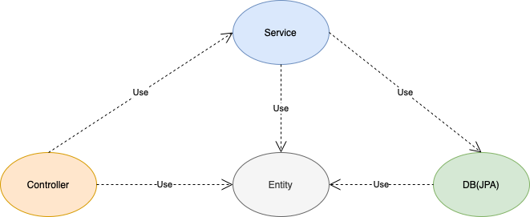

## How to run
Run this app locally executing the following command in the terminal:

    mvn package && java -jar target/todos-java-api-1.0-SNAPSHOT.jar

Now you can open [Postman](https://www.getpostman.com/downloads/) and in the body of you POST write
your GraphQL query pointing to *http://localhost:8080/graphql*.

## Design Choices
- Database (h2)
- ORM (Object-relational Mapping)
- JPA (Java Persistence API; currently rebranded to Jakarta Persistence)
- Repository Pattern
> "Mediates between the domain and data mapping layers using a collection-like interface for accessing domain objects" (Patterns of Enterprise Application Architecture) - Fowler, Martin
- Spring Data JPA
  - Avoid boilerplate code
  - No DTO objects needed
- Layers:

